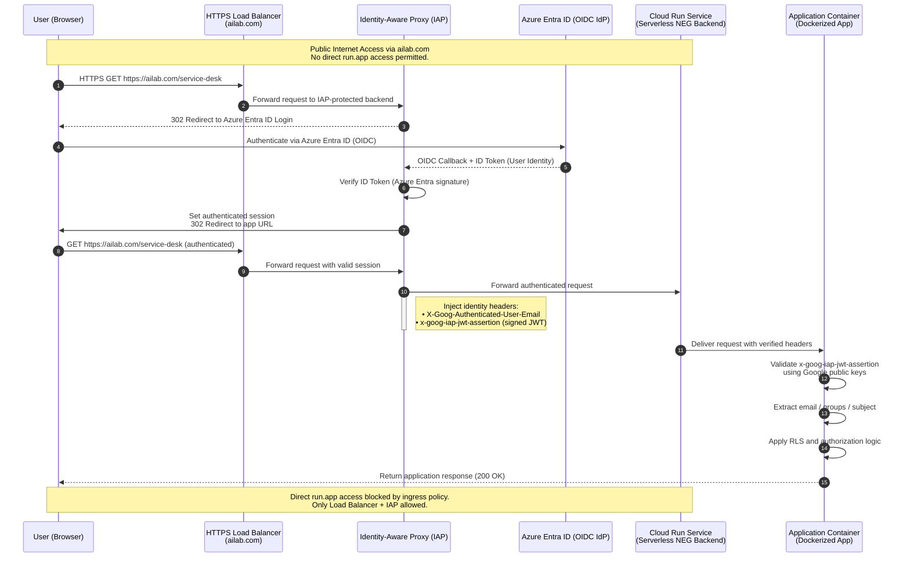

# Serverless Identity Enforcement via IAP and OIDC Federation
Zero-Trust OIDC Gateway: Azure Entra ID to Cloud Run via IAP

Architecture Overview

Multiple Dockerized applications are deployed on Cloud Run:

https://ailab.com/service-desk

https://ailab.com/marketing-immersion

https://ailab.com/asset-scanning

Applications are exposed via a global HTTPS Load Balancer using Serverless Network Endpoint Groups (NEGs) that point to Cloud Run services.

The domain ailab.com fronts all applications through the Load Balancer.

Ingress on Cloud Run is configured as internal-only, denying direct run.app access.

Azure Entra ID (Microsoft AD) serves as the OIDC Identity Provider for user authentication.

Identity-Aware Proxy (IAP) is positioned between the Load Balancer and Cloud Run to handle user authentication and token verification.

Current Problem

Cloud Run blocks unauthenticated requests with HTTP 403 before they reach the application.

The OIDC callback from the IdP (/auth/login) also fails with 403 because Cloud Run denies access before the app can handle the authentication flow.

Direct public access to run.app URLs must remain blocked for security and compliance.

Requirements

Applications must be publicly accessible over the Internet but only via the Load Balancer and IAP.

Direct Cloud Run access (run.app) must be denied.

Azure Entra ID must handle user authentication (OIDC).

The application must receive a verified user identity (ID token / email / groups) for Row-Level Security (RLS) enforcement.

The architecture must not use Identity Platform due to corporate restrictions.

Solution Approach

Use Cloud Load Balancing + IAP + Cloud Run (Serverless NEG) architecture.

IAP handles the full OIDC login flow with Azure Entra:

Redirects users to the IdP.

Accepts the authentication callback.

Forwards authenticated traffic to Cloud Run.

Cloud Run ingress is limited to internal and Cloud Load Balancing, ensuring only IAP traffic is accepted.

IAP injects a signed identity assertion (x-goog-iap-jwt-assertion) into each request.

The Cloud Run backend validates this IAP-signed JWT using Google public keys, verifying:

Signature integrity

Audience and issuer

After validation, the backend extracts user identity claims (email, groups) and applies RLS policies.

Related Consideration

For GCP IAM access (not application login), use Workforce Identity Federation to map Azure Entra identities to GCP IAM principals for secure, short-lived credentials—separate from the web app authentication flow.

