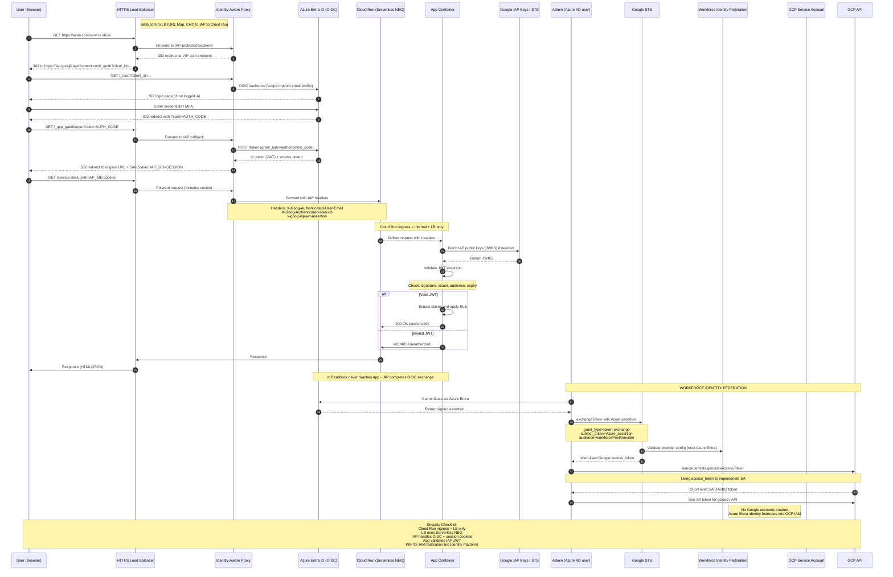

# Serverless Identity Enforcement via IAP and OIDC Federation
Zero-Trust OIDC Gateway: Azure Entra ID to Cloud Run via IAP

## Architecture Overview

- Multiple **Dockerized applications** are deployed on Google **Cloud Run**.
    - https://ailab.com/ - this is the landing page
    - https://ailab.com/login
    - https://ailab.com/logout
    - https://ailab.com/service-desk
    - https://ailab.com/marketing-immersion
    - https://ailab.com/asset-scanning 
- Each service has **Ingress restricted** to “internal + load balancer” — **direct external access to run.app URLs is denied**.
- All applications are fronted by a **Global HTTPS Load Balancer** configured with **Serverless Network Endpoint Groups** (**NEGs**) pointing to the respective **Cloud Run services**.
- The domain `ailab.com` routes via this **Load Balancer** (e.g., `/`, `/login`, `/service-desk`, etc.).
- A **Google-managed SSL certificate** and **URL map** handle **HTTPS termination** and **routing**.

## Access and Authentication Requirements
- Applications must be accessible **publicly** (Internet-facing) but **deny direct access to Cloud Run endpoints**.
- All requests must pass through the **Load Balancer** and **authentication layer**.
- **Unauthenticated** or **unauthorized requests** must be **blocked** without exception.
- Authentication uses **OIDC** with **Azure Entra ID** (Microsoft AD-backed IdP).
- The solution must implement **SSO with cookie-based sessions** and **user-based RLS** (Row-Level Security) in backend services.
- Backend apps require access to a **verified user identity** (`ID token`, `email`, `groups`) for **access control** and **personalization**.

## Problem Statement
- Cloud Run’s **ingress restriction** causes **403 errors** for **IdP callback requests** (`/auth/login`), because the service blocks **unauthenticated requests before the OIDC flow completes**.
- Current setup **cannot complete the OIDC redirect cycle within the app itself** — **the callback is never seen by the container due to ingress policy**.
- You need to maintain both:
    - **Public accessibility via Load Balancer**, and
    - **Strict access control** that prevents direct `run.app` or bypass traffic.

## Proposed Solution
- Enable **Identity-Aware Proxy (IAP)** on the **Load Balancer backend service** (the Serverless NEG).
  
- IAP will:
    - **Terminate the OIDC flow** with Azure Entra ID directly.
    - **Authenticate** the user and **set the session cookie**.
    - **Forward** only **authenticated requests** to Cloud Run.
    - **Inject signed identity headers** (`X-Goog-Authenticated-User-Email`) and the `x-goog-iap-jwt-assertion` token.
      
- **Cloud Run** will:
    - **Trust** traffic only from the Load Balancer/IAP (via ingress restriction).
    - **Validate IAP’s JWT assertion** using Google public keys and the expected audience/issuer.
    - Use the **verified identity claims** (`email`, `groups`) for **RLS enforcement**.
    - This eliminates the “403-before-OIDC” problem: **IAP handles the authentication externally**, so **Cloud Run only receives authenticated**, **identity-bearing requests**.

## Workforce Identity Federation (WIF)
- **Value**: Since Identity Platform is disallowed, Workforce Identity Federation (WIF) provides a compliant way to integrate Azure Entra ID with GCP for IAM and API-level access, distinct from app authentication.
- **Purpose**: Allow Azure Entra users to assume GCP IAM roles without creating Google identities.
- **Value**:
    - Enables **federated login** from Azure AD to Google Cloud for administrative or programmatic access (e.g., gcloud, APIs).
    - **Maintains a single corporate IdP** (Azure Entra) while enforcing centralized IAM policies in GCP.
    - **Avoids local Google account management**, aligning with **enterprise identity governance**.
- **Note**: WIF is for cloud IAM federation, not for front-end application authentication — that function is handled by IAP with OIDC to Azure Entra.

## Flow

## Summary

| Concern                                | Resolution                                           |
| -------------------------------------- | ---------------------------------------------------- |
| Direct `run.app` access                | Restrict Cloud Run ingress to LB + IAP               |
| OIDC callback 403                      | Offload OIDC to IAP                                  |
| Authenticated user identity to backend | Validate `x-goog-iap-jwt-assertion`                  |
| Central IdP (Azure Entra)              | Use as OIDC provider for IAP                         |
| No Identity Platform allowed           | Use Workforce Identity Federation for GCP IAM access |

## Key elements

- **Traffic path**: User → LB (TLS termination) → IAP (auth) → Serverless NEG → Cloud Run → Container.
- **Cookies**: IAP sets a secure HttpOnly cookie (IAP_SID) for session SSO; cookie is bound to IAP session.
- **OIDC handling**: IAP performs full OIDC Authorization Code flow with Azure Entra (code → token exchange). App does not handle the IdP callback.
- **Identity headers & assertion**:
    - `x-goog-iap-jwt-assertion` — signed JWT created by IAP. Validate signature, iss, aud, exp.
    - `X-Goog-Authenticated-User-Email` — convenience header (do not trust alone).
    - `X-Goog-Authenticated-User-ID` — subject identifier.
- **Validation**: App must fetch/ cache Google's IAP public keys (JWKS), verify signature, issuer https://cloud.google.com/iap, expected audience (IAP client/back-end ID), expiration, and required claims (email, sub). Only then use claims for RLS.
- **Ingress restriction**: Cloud Run ingress must be set to only allow traffic from Load Balancer (IAP) / internal — prevents direct run.app bypass.
- **Workforce Identity Federation**:
    - Azure Entra users obtain SAML/OIDC assertion
    - Exchange assertion at Google STS/WIF to receive a short-lived Google access token.
    - Optionally impersonate a Service Account (iamcredentials.generateAccessToken) to get SA-scoped short-lived credentials.
    - Use these for gcloud, API, or admin actions — avoids creating Google-managed accounts and abides by your no-Identity-Platform constraint.

## Bibliography
- https://medium.com/google-cloud/nuts-and-bolts-of-negs-network-endpoint-groups-in-gcp-35b0d06f4691
- https://medium.com/google-cloud/fortifying-your-cloud-zero-trust-with-identity-aware-proxy-iap-ba4a69124e40

