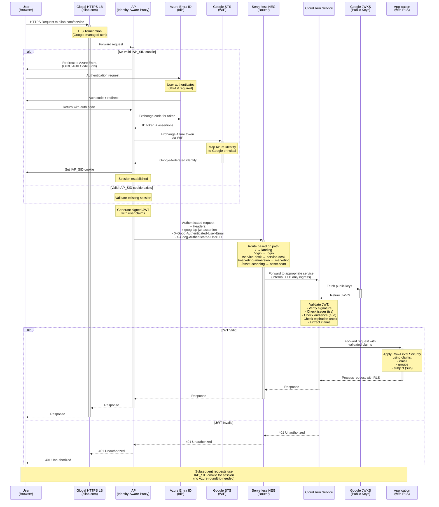

# Serverless Identity Enforcement via IAP and OIDC Federation
Zero-Trust OIDC Gateway: Azure Entra ID to Cloud Run via IAP

## Architecture Overview

- Multiple **Dockerized applications** are deployed on Google **Cloud Run**.
    - https://ailab.com/ - this is the landing page
    - https://ailab.com/login
    - https://ailab.com/logout
    - https://ailab.com/service-desk
    - https://ailab.com/marketing-immersion
    - https://ailab.com/asset-scanning 
- Each service has **Ingress restricted** to “internal + load balancer” — **direct external access to run.app URLs is denied**.
- All applications are fronted by a **Global HTTPS Load Balancer** configured with **Serverless Network Endpoint Groups** (**NEGs**) pointing to the respective **Cloud Run services**.
- The domain `ailab.com` routes via this **Load Balancer** (e.g., `/`, `/login`, `/service-desk`, etc.).
- A **Google-managed SSL certificate** and **URL map** handle **HTTPS termination** and **routing**.

## Access and Authentication Requirements
- Applications must be accessible **publicly** (Internet-facing) but **deny direct access to Cloud Run endpoints**.
- All requests must pass through the **Load Balancer** and **authentication layer**.
- **Unauthenticated** or **unauthorized requests** must be **blocked** without exception.
- Authentication uses **OIDC** with **Azure Entra ID** (Microsoft AD-backed IdP).
- The solution must implement **SSO with cookie-based sessions** and **user-based RLS** (Row-Level Security) in backend services.
- Backend apps require access to a **verified user identity** (`ID token`, `email`, `groups`) for **access control** and **personalization**.

## Problem Statement
- Cloud Run’s **ingress restriction** causes **403 errors** for **IdP callback requests** (`/auth/login`), because the service blocks **unauthenticated requests before the OIDC flow completes**.
    - Cloud Run’s **ingress** is **internal + Load Balancer only**, so it **rejects requests** that **don’t already have a valid IAP session**.
- Current setup **cannot complete the OIDC redirect cycle within the app itself** — **the callback is never seen by the container due to ingress policy**.
- You need to maintain both:
    - **Public accessibility via Load Balancer**, and
    - **Strict access control** that prevents direct `run.app` or bypass traffic.

## Flow

## Summary

| Concern                                | Resolution                                           |
| -------------------------------------- | ---------------------------------------------------- |
| Direct `run.app` access                | Restrict Cloud Run ingress to LB + IAP               |
| OIDC callback 403                      | Offload OIDC to IAP                                  |
| Authenticated user identity to backend | Validate `x-goog-iap-jwt-assertion`                  |
| Central IdP (Azure Entra)              | Use as OIDC provider for IAP                         |
| No Identity Platform allowed           | Use Workforce Identity Federation for GCP IAM access |

## Key elements

## How IAP Works (High-Level — Google Cloud Example)

1. **User Request**: A user attempts to access an application URL protected by IAP.
2. **Redirection to Identity Provider**: IAP **intercepts the request** and **redirects the user to our configured identity provider** (~~e.g., Google Sign-In~~) if they don’t have **a valid session**.
3. **Authentication**: The user authenticates with the identity provider.
4. **Token & Identity Assertion**: Upon successful authentication, the identity provider **issues an identity token to IAP**.
5. **Authorization Check**: IAP **verifies the user’s identity** and checks against **IAM policies** to determine **if they are authorized to access the requested resource**. It can also check against **Access Context Manager policies**.
6. **Request Forwarding (with Identity)**: If authorized, IAP **forwards the request to the backend application**. Crucially, IAP adds **signed headers** (e.g., `X-Goog-Authenticated-User-Email`, `X-Goog-Authenticated-User-Id`, `X-Goog-IAP-JWT-Assertion`) containing the **verified user's identity**.
7.	**Application Logic (Optional)**: Your application can (and often should) **use these headers for further fine-grained**, **in-app authorization** or **personalization**.
8.	**Backend Firewall**: Our backend service (e.g., GCE instances, App Engine, GKE) should be **firewalled to only accept traffic from IAP’s known IP ranges** or its specific proxy mechanism.

## Bibliography
- https://medium.com/google-cloud/nuts-and-bolts-of-negs-network-endpoint-groups-in-gcp-35b0d06f4691
- https://medium.com/google-cloud/fortifying-your-cloud-zero-trust-with-identity-aware-proxy-iap-ba4a69124e40

