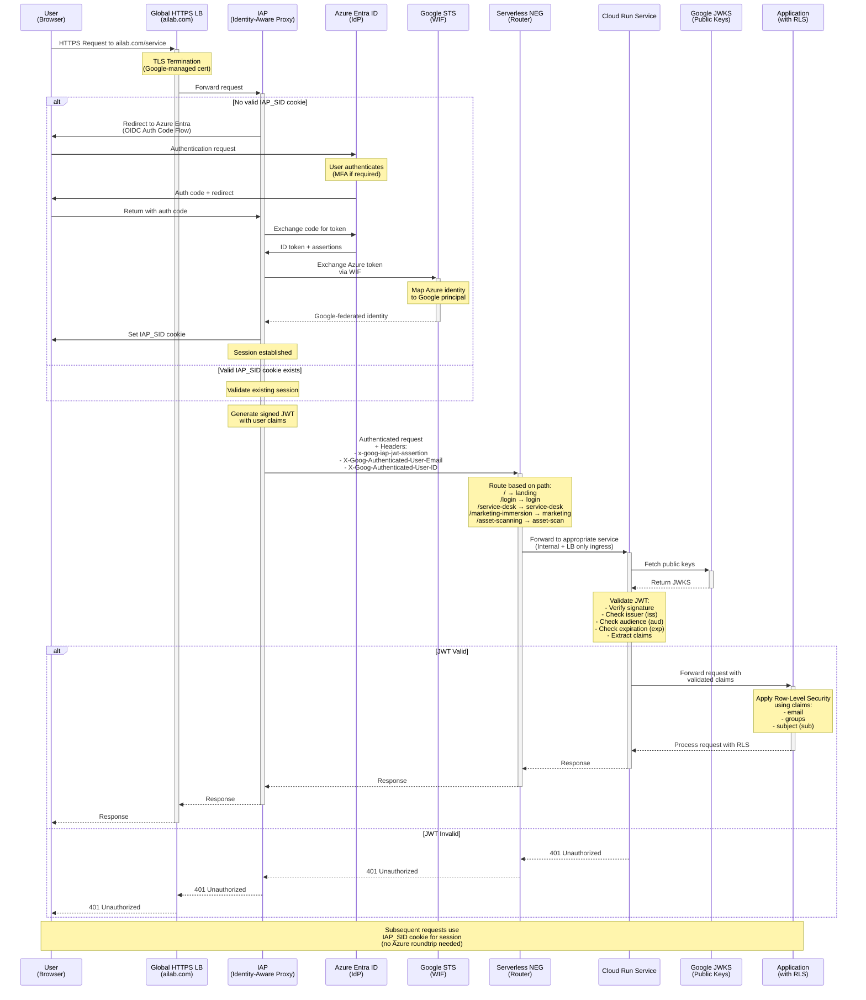

# Serverless Identity Enforcement via IAP and OIDC WIF Federation with Azure Entra ID
- [OIDC + IAP Problem Explained](https://github.com/adriensieg/Serverless-Identity-Enforcement-via-IAP-and-OIDC-Federation/blob/master/README.md#oidc--iap-problem-explained)
- [What's Identity Aware Proxy?](https://github.com/adriensieg/Serverless-Identity-Enforcement-via-IAP-and-OIDC-Federation/blob/master/README.md#whats-identity-aware-proxy)
- [Why do I need Workforce Identity Federation?](https://github.com/adriensieg/Serverless-Identity-Enforcement-via-IAP-and-OIDC-Federation/blob/master/README.md#why-do-i-need-workforce-identity-federation)
- [Architecture Overview](https://github.com/adriensieg/Serverless-Identity-Enforcement-via-IAP-and-OIDC-Federation/blob/master/README.md#architecture-overview)
 - [Context and Requirements](https://github.com/adriensieg/Serverless-Identity-Enforcement-via-IAP-and-OIDC-Federation/blob/master/README.md#context-and-requirements)
 - [Network and Access Architecture](https://github.com/adriensieg/Serverless-Identity-Enforcement-via-IAP-and-OIDC-Federation/blob/master/README.md#network-and-access-architecture)
 - [Authentication and Authorization via IAP](https://github.com/adriensieg/Serverless-Identity-Enforcement-via-IAP-and-OIDC-Federation/blob/master/README.md#authentication-and-authorization-via-iap)
 - [Identity Propagation to Cloud Run](https://github.com/adriensieg/Serverless-Identity-Enforcement-via-IAP-and-OIDC-Federation/blob/master/README.md#identity-propagation-to-cloud-run)
 - [Security Enforcement](https://github.com/adriensieg/Serverless-Identity-Enforcement-via-IAP-and-OIDC-Federation/blob/master/README.md#security-enforcement)
 - [Workforce Identity Federation (WIF) Integration](https://github.com/adriensieg/Serverless-Identity-Enforcement-via-IAP-and-OIDC-Federation/blob/master/README.md#workforce-identity-federation-wif-integration)
- [Flow](https://github.com/adriensieg/Serverless-Identity-Enforcement-via-IAP-and-OIDC-Federation/blob/master/README.md#flow)
- [Summary](https://github.com/adriensieg/Serverless-Identity-Enforcement-via-IAP-and-OIDC-Federation/blob/master/README.md#summary)
- [Bibliography](https://github.com/adriensieg/Serverless-Identity-Enforcement-via-IAP-and-OIDC-Federation/blob/master/README.md#bibliography)

## OIDC + IAP Problem Explained
We cannot implement **OIDC authentication** inside **our Cloud Run app** when **IAP is enabled** because of a *chicken-and-egg problem*:
IAP handles authentication **BEFORE** Cloud Run. **IAP intercepts all requests at the Load Balancer**

**The Authentication Deadlock**:
- Our app needs to **handle OIDC callbacks** (from Azure Entra ID) to **authenticate users**
- But Cloud Run **blocks all requests** without **valid IAP authentication**
  - Cloud Run ingress setting: `"internal + load balancer"` = only accepts requests with valid IAP session
  - **Ingress policy** only allows **authenticated traffic**
- The **OIDC callback** can't reach our app because it's **not authenticated yet**
  - **OIDC requirement**: Must receive unauthenticated callbacks to complete authentication
  - **Result**: Our app cannot complete its own authentication flow
- **Result**: `403 error` when Azure tries to redirect back to `/auth/login`
  - The callback never reaches our container

## What's Identity Aware Proxy? 
- Identity-Aware Proxy (IAP) is called **"identity aware"** because it **makes access decisions** based on **who the user is** (**their identity**) rather than just where they're **connecting from** (**like an IP address or network location**).

- **Traditional approach**: A firewall or VPN might say "allow traffic from this IP range" - it's **network-aware** but doesn't really know **who the individual user is**.
- **Identity-Aware approach**: IAP authenticates each user and checks their specific identity (via Google accounts, Cloud Identity, etc.) before granting access to your applications. It asks "Is this specific person authorized?" rather than "Is this request from an authorized network?"

#### How IAP Works (High-Level — Google Cloud Example)
1. **User Request**: A user attempts to access an application URL protected by IAP.
2. **Redirection to Identity Provider**: IAP **intercepts the request** and **redirects the user to our configured identity provider** (~~e.g., Google Sign-In~~) if they don’t have **a valid session**.
3. **Authentication**: The user authenticates with the identity provider.
4. **Token & Identity Assertion**: Upon successful authentication, the identity provider **issues an identity token to IAP**.
5. **Authorization Check**: IAP **verifies the user’s identity** and checks against **IAM policies** to determine **if they are authorized to access the requested resource**. It can also check against **Access Context Manager policies**.
6. **Request Forwarding (with Identity)**: If authorized, IAP **forwards the request to the backend application**. Crucially, IAP adds **signed headers** (e.g., `X-Goog-Authenticated-User-Email`, `X-Goog-Authenticated-User-Id`, `X-Goog-IAP-JWT-Assertion`) containing the **verified user's identity**.
7.	**Application Logic (Optional)**: Your application can (and often should) **use these headers for further fine-grained**, **in-app authorization** or **personalization**.
8.	**Backend Firewall**: Our backend service (e.g., GCE instances, App Engine, GKE) should be **firewalled to only accept traffic from IAP’s known IP ranges** or its specific proxy mechanism.

## Why do I need Workforce Identity Federation? 
[“I don’t want my internal users synced to Google”?](https://medium.com/@oluakin/implementing-external-authentication-using-identity-aware-proxy-iap-quick-tips-093d60c8a9b4)

- **IAP** needs to **understand identities** in **Google Cloud's terms**.
- It needs to **map external identities** to **Google Cloud principals** (like **user accounts** or **service accounts**) so it can make authorization decisions.
  
- *The solution*: Workforce Identity Federation allows us to:
  - **Federate our Azure Entra ID** - Set up a trust relationship between Google Cloud and your Azure tenant
  - **Map external identities** - Configure how Azure Entra ID users/groups map to Google Cloud principals
  - **Authenticate without Cloud Identity** - Users sign in with their Azure credentials, and Google Cloud recognizes them through federation

**IAP handles the OIDC flow for us!** We don't need to implement it in our app.
- **IAP** acts as the **OIDC client**
- When a user hits our app, **IAP intercepts the request**
- IAP redirects them to **authenticate with Azure Entra ID** (via **Workforce Identity Federation**)
- **Azure authenticates the user** and returns **tokens**
- **IAP validates** everything and handles the **token exchange**
- If authorized, IAP forwards the request to our app with **identity headers**
- Our app receives:
  - The **request already authenticated**
  - **Identity information in HTTP headers** (like `X-Goog-IAP-JWT-Assertion`)
  - We can optionally validate the **IAP JWT** if we want extra security, but the heavy lifting is done

**What you configure (not implement)**:
- Set up **Workforce Identity Federation with Azure Entra ID in Google Cloud**
- Configure **IAP to use that federation**
- **Set IAP access policies (who can access what)**

# Architecture Overview
## Context and Requirements
- Multiple **Dockerized applications** are deployed on Google **Cloud Run**.
    - https://ailab.com/ - this is the landing page
    - https://ailab.com/login
    - https://ailab.com/logout
    - https://ailab.com/service-desk
    - https://ailab.com/marketing-immersion 
    - https://ailab.com/asset-scanning
- The platform must be **publicly accessible** (Internet-facing) but **securely authenticated** — **no direct access to Cloud Run’s `run.app` endpoints**.
- Each service has **Ingress restricted** to `“internal + load balancer”` — **direct external access to run.app URLs is denied**.
- **Identity Platform** cannot be used due to corporate policy constraints.
- Authentication and SSO must be handled via **Azure Entra ID (OIDC)** with **cookie-based sessions**.
- **User identity** (email, groups) must be available to backend apps for Row-Level Security (RLS) and personalization.

## Network and Access Architecture
- Each Cloud Run service has **Ingress restricted** to `“Internal + Load Balancer”` — **denies direct Internet access**.
- A **Global HTTPS Load Balancer (GCLB)** fronts all services using **Serverless Network Endpoint Groups (NEGs)**.
- The **domain (ailab.com)** routes through the GCLB using a **Google-managed SSL certificate** and **URL map** for **path-based routing**.
- All traffic flows through this path:
```
User → HTTPS LB (TLS termination) → IAP (auth) → Serverless NEG → Cloud Run → Container.
```

## Authentication and Authorization via IAP
- Identity-Aware Proxy (IAP) is enabled on the backend service (Serverless NEG).
- **IAP performs full OIDC Authorization Code Flow with Azure Entra ID** — **the application does not handle OIDC directly**.
- Workforce Identity Federation (WIF) bridges Azure Entra identities with Google Cloud:
  - **Establishes trust** between Azure Entra and Google Cloud.
  - **Maps Azure users/groups to Google Cloud principals**.
  - Allows IAP to **recognize** and **authorize** users **without Cloud Identity accounts**.
  - IAP sets a secure `HttpOnly` session cookie (**IAP_SID**) for SSO.
- Only **authenticated** and **authorized** requests are forwarded to Cloud Run.

## Identity Propagation to Cloud Run
- IAP injects **signed identity headers**:
 - `X-Goog-Authenticated-User-Email` – user email (for convenience).
 - `X-Goog-Authenticated-User-ID` – unique user identifier.
 - `x-goog-iap-jwt-assertion` – signed JWT assertion with verified user claims.
   
- Cloud Run services must:
 - **Validate** the JWT using Google’s public keys (JWKS).
 - Check **issuer**, **audience**, **expiration**, and **email/sub claims**.
 - Use claims for **RLS** and **access control decisions**.

## Security Enforcement
- Cloud Run **ingress policy** ensures only the **Load Balancer/IAP can reach the service**.
- Direct access via `run.app` URLs is **completely denied**.
- IAP handles authentication externally, preventing **“403-before-OIDC” issues** — apps receive **only validated**, **identity-bearing requests**.
- **Session SSO managed** entirely by IAP; cookies are **secure**, **domain-bound**, and **non-extractable by apps**.

## Workforce Identity Federation (WIF) Integration
- **Azure Entra users** authenticate via **OIDC/SAML**.
- **WIF exchanges** the **Azure assertion** for a **short-lived Google STS token**.
- Optional **Service Account impersonation** can grant scoped access to Google APIs without native Google accounts.
- Enables full **identity continuity** across Azure and Google without duplicating users in Cloud Identity.

# Flow



## Summary
- **Complies with policy**: Avoids Identity Platform while achieving federated SSO.
- **Centralized auth**: IAP handles OIDC, token validation, and sessions — apps stay stateless and simple.
- **End-to-end identity assurance**: Every request carries a signed, verifiable identity from Azure Entra ID through Google IAP to Cloud Run.
- **Strong perimeter security**: No public Cloud Run endpoints; all access enforced via HTTPS LB + IAP.
- **Operational simplicity**: No custom auth code, token storage, or redirect handling inside applications.
- **Seamless federation**: WIF maps Azure users directly into Google’s access model for consistent policy enforcement.
- **Scalable and secure**: Fully managed authentication and load balancing for multiple independent microservices.

# Implementation

### 1. Set Up the Foundation

##### A. Google Cloud Project

```
export PROJECT_ID="your-project-id"
gcloud config set project $PROJECT_ID

# Enable required APIs
gcloud services enable run.googleapis.com
gcloud services enable iap.googleapis.com
gcloud services enable compute.googleapis.com
gcloud services enable iam.googleapis.com
gcloud services enable certificatemanager.googleapis.com
```
##### B. Create our Cloud Run Services
- Dockerfile
- Python - fastapi
- templates/index.html
- static/script.js
- static/styles.css
- requirements.txt

```
# Build and deploy each service
gcloud run deploy landing-page \
  --source . \
  --region us-central1 \
  --platform managed \
  --ingress internal-and-cloud-load-balancing \
  --allow-unauthenticated
```

### 2. Set Up Workforce Identity Federation
##### Configure Azure Entra ID Application
In *Azure Portal*:
- Go to Azure Active Directory → **App registrations**
- Click **New registration**
- *Name*: "AILab Google Cloud IAP"
- **Redirect URI**: `https://iap.googleapis.com/v1/oauth/clientIds/[CLIENT_ID]:handleRedirect`
(We'll update this later with actual **CLIENT_ID**)

Note down:
- **Application (client) ID**
- **Directory (tenant) ID**
- Create a **client secret** and note it

##### Create Workforce Identity Pool

```
# Create the pool
gcloud iam workforce-pools create ailab-workforce \
  --location global \
  --description "AILab Workforce Pool for Azure AD"

# Create the provider
gcloud iam workforce-pools providers create-oidc azure-provider \
  --location global \
  --workforce-pool ailab-workforce \
  --issuer-uri "https://login.microsoftonline.com/YOUR_TENANT_ID/v2.0" \
  --client-id "YOUR_AZURE_APP_CLIENT_ID" \
  --client-secret-value "YOUR_AZURE_CLIENT_SECRET" \
  --web-sso-response-type "code" \
  --web-sso-assertion-claims-behavior merge \
  --web-sso-additional-scopes "openid,profile,email" \
  --attribute-mapping "google.subject=assertion.sub,google.groups=assertion.groups,attribute.email=assertion.email"
```

### 3. Set Up Load Balancer and NEGs
##### Create Backend Services with NEGs

```
# Create a NEG for each Cloud Run service
gcloud compute network-endpoint-groups create landing-page-neg \
  --region us-central1 \
  --network-endpoint-type serverless \
  --cloud-run-service landing-page

# Create backend service
gcloud compute backend-services create ailab-backend \
  --global \
  --load-balancing-scheme EXTERNAL_MANAGED

# Add the NEG to backend service
gcloud compute backend-services add-backend ailab-backend \
  --global \
  --network-endpoint-group landing-page-neg \
  --network-endpoint-group-region us-central1
```

##### Configure URL Map for Path Routing

```
# url-map.yaml
defaultService: https://www.googleapis.com/compute/v1/projects/PROJECT_ID/global/backendServices/landing-page-backend
hostRules:
  - hosts:
      - ailab.com
    pathMatcher: ailab-paths
pathMatchers:
  - name: ailab-paths
    defaultService: https://www.googleapis.com/compute/v1/projects/PROJECT_ID/global/backendServices/landing-page-backend
    pathRules:
      - paths:
          - /login
        service: https://www.googleapis.com/compute/v1/projects/PROJECT_ID/global/backendServices/login-backend
      - paths:
          - /logout
        service: https://www.googleapis.com/compute/v1/projects/PROJECT_ID/global/backendServices/logout-backend
      - paths:
          - /service-desk
        service: https://www.googleapis.com/compute/v1/projects/PROJECT_ID/global/backendServices/service-desk-backend
```
Apply it:
```
gcloud compute url-maps import ailab-url-map \
  --source url-map.yaml \
  --global
```


## Bibliography
- https://medium.com/google-cloud/nuts-and-bolts-of-negs-network-endpoint-groups-in-gcp-35b0d06f4691
- https://medium.com/google-cloud/fortifying-your-cloud-zero-trust-with-identity-aware-proxy-iap-ba4a69124e40
- [Configuring Google as a federated identity provider in AWS Cognito](https://www.youtube.com/watch?v=ruPCv3qaZIs&t=302s)
- [Workforce Identity Federation and IAP (Identity-Aware Proxy) in GCP: a working example](https://medium.com/@jt151077/workforce-identity-federation-and-iap-identity-aware-proxy-in-gcp-a-working-example-76db527174b3)
- [Secure Cloud Run With Auth0 and Workforce Identity Federation](https://www.wallacesharpedavidson.nz/post/workforce-identity-auth0-cloudrun-iap/)
- [How to leverage Google Cloud Identity Aware Proxy with External Identities](https://www.youtube.com/watch?v=qAjecymWK88&t=1568s
- [https://cloud.google.com/iap/docs/use-workforce-identity-federation](https://cloud.google.com/iap/docs/use-workforce-identity-federation)


- [Configure Custom Domain in GCP with DNS | Web Server | Virtual Machine](https://cloud.google.com/iap/docs/use-workforce-identity-federation](https://www.youtube.com/watch?v=g1KKI7JVJH8&t=465s)


